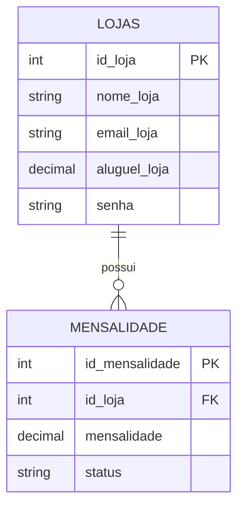

# 🗄️ Esquema do Banco de Dados: Galpax

Este documento contém o script necessário para criar o banco de dados local. Caso o sistema esteja em `isMock = false`, estas tabelas devem existir no MySQL.

## 📊 Estrutura de Dados

## 📜 Script de Instalação (Master)

Utilize o arquivo **`GALPAX_MASTER_INSTALL.sql`** localizado na raiz deste projeto para criar todas as tabelas e popular o sistema com dados de teste.

### Como usar:
1.  Abra seu MySQL Workbench ou terminal.
2.  Execute o comando: `source GALPAX_MASTER_INSTALL.sql;`
3.  Configure seu arquivo `secrets.properties` com as credenciais do seu banco local.

---
[[README|🏠 Voltar ao Início]]
